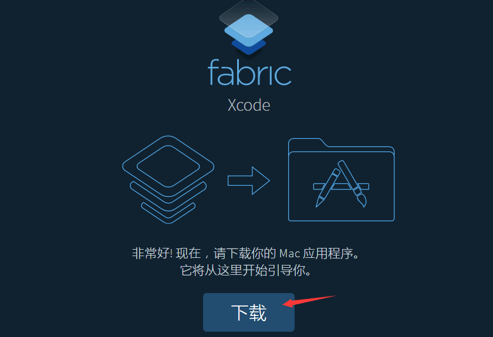
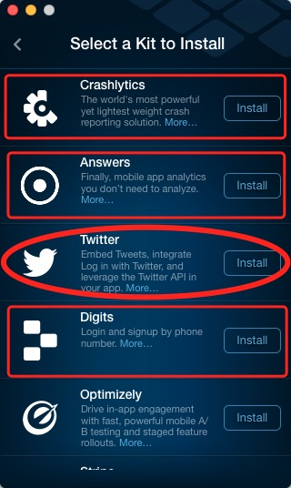
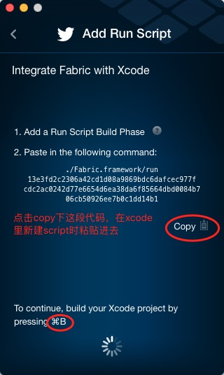
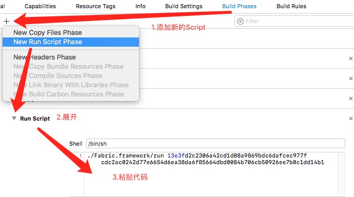
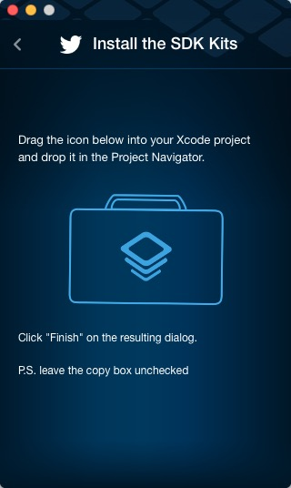
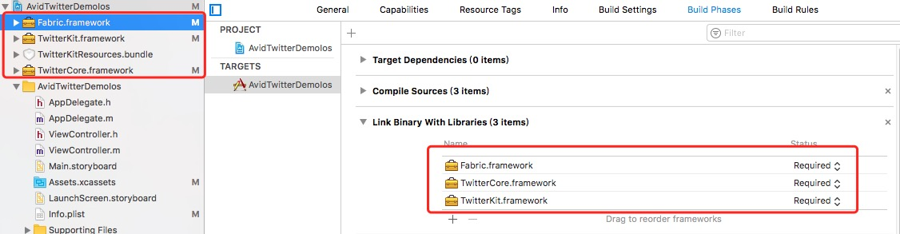
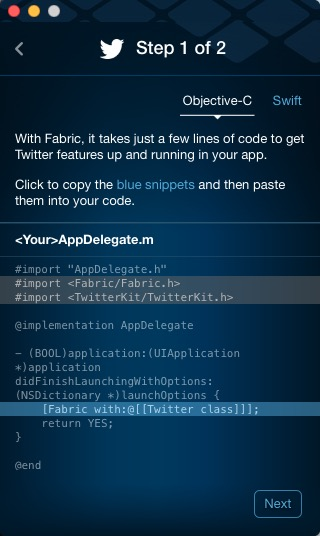
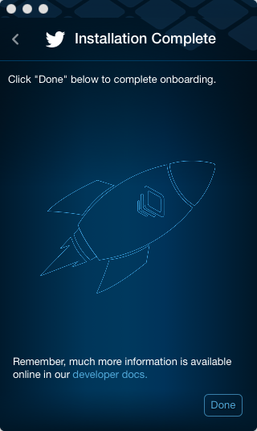
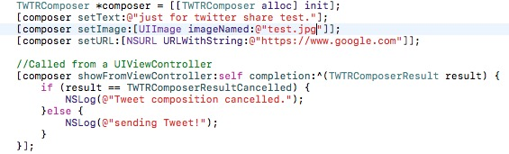

#AvidTwitterDemoIos
##[官方文档](https://docs.fabric.io/apple/twitter/compose-tweets.html)
###1. mac上用Xcode打开项目，前往[Fabric](https://fabric.io/downloads/xcode)下载官方推出的Fabric
###2. 下载完成后，点击运行Fabric,选择项目
###3. 选择Twitter进行安装，（此外三个矩形框里的SDK是跟数据分析和bug上报相关，可自行根据需要安装）
###4. 配置工程，先copy下这段代码，然后打开Xcode,添加新的script，然后command+b。如图
###5. 之后会看到提示：`Drag the icon below into your Xcode project and drop it in the Project Navigator.`，根据提示，将图标拖入工程中，就会自动添加好需要的库文件
###6. 根据提示，将代码copy加入工程。
###7. 最后，command+R,如果没有错误，将会出现图示内容，那么Twitter SDK就安装完成了。
###8. 最后调分享接口，进行Twitter分享。

###*注：详细请查看Demo*